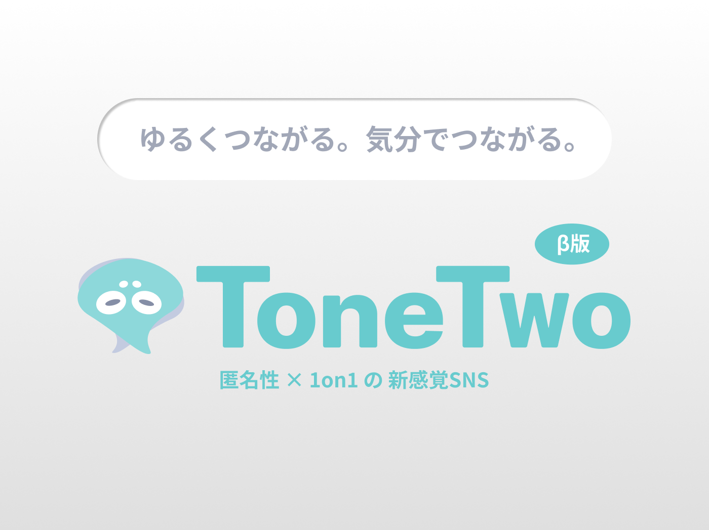
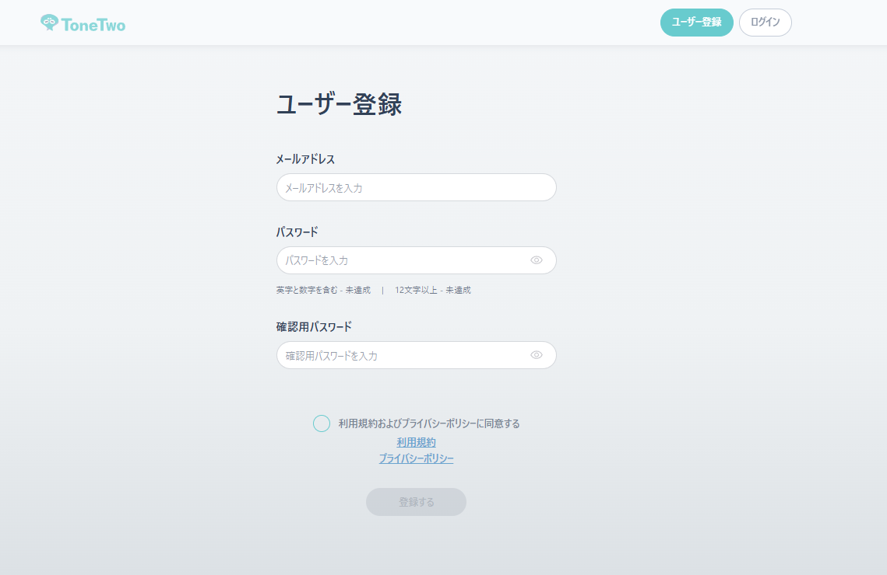
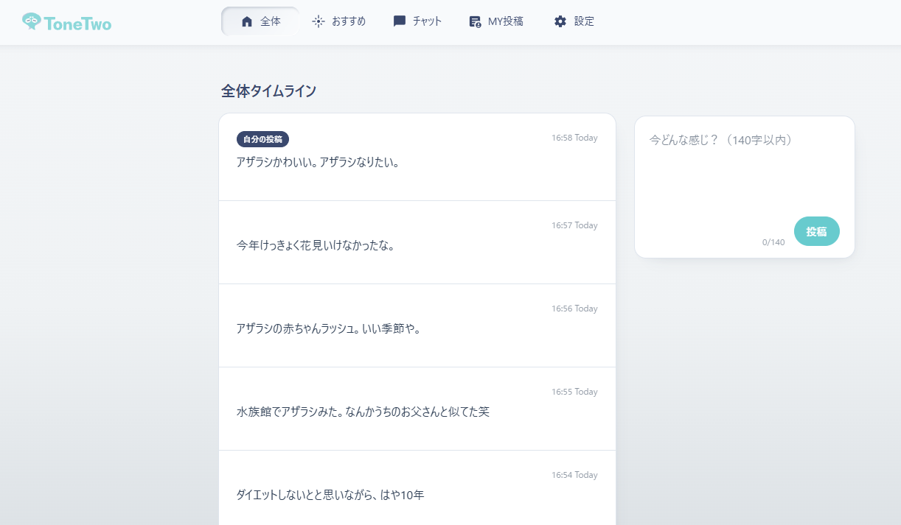
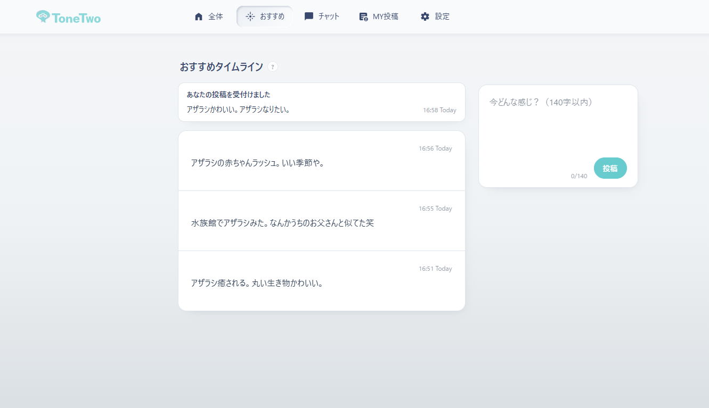
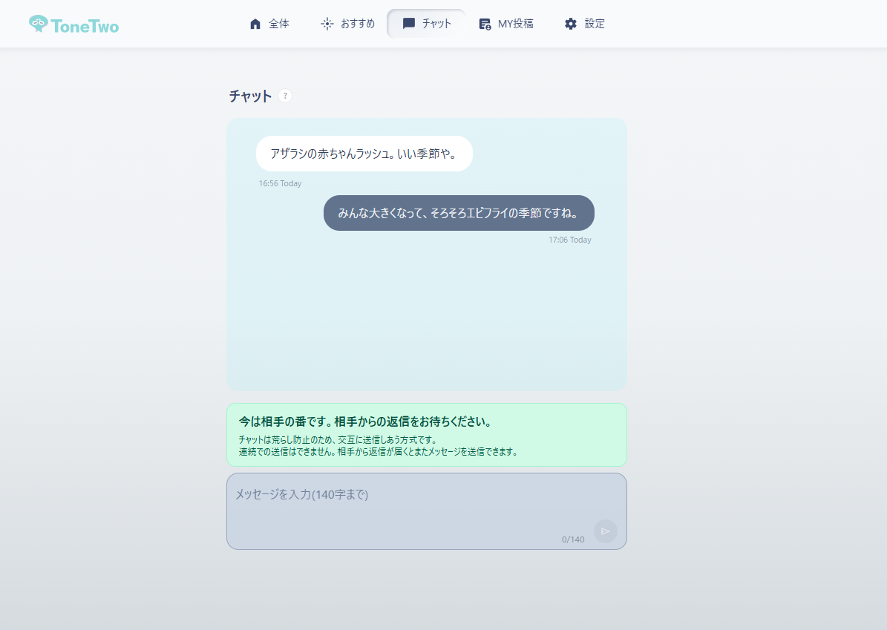
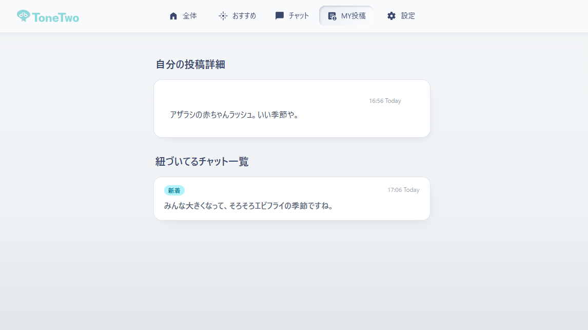
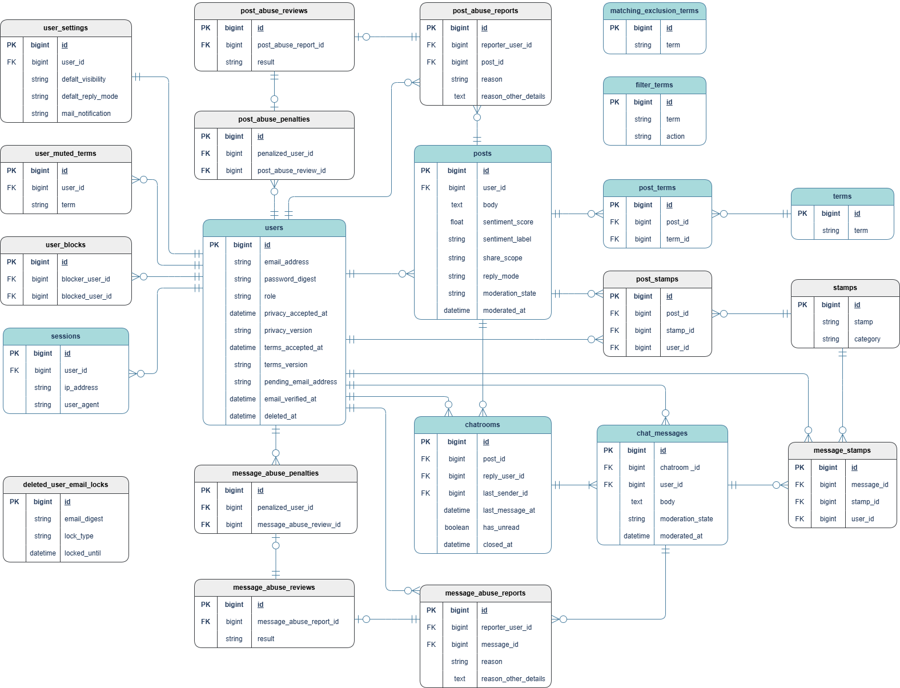
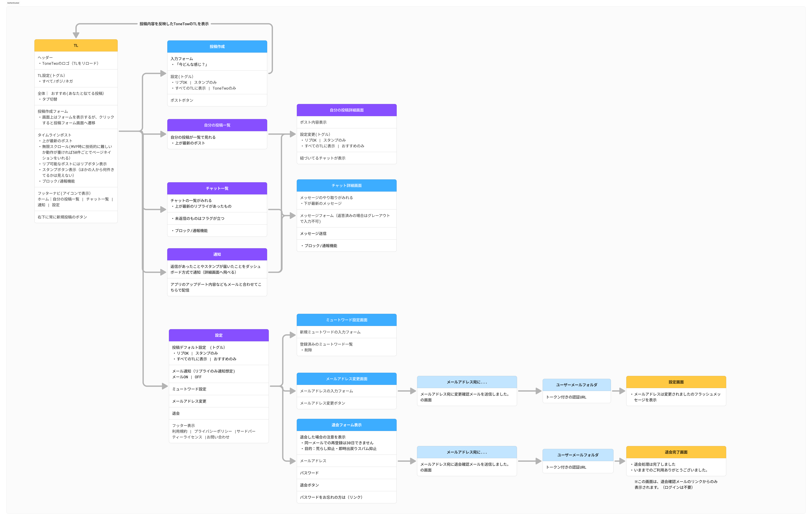

## サービス名 ToneTwo(トーン・ツー)
<a href="https://www.tonetwo.net/" target="_blank" rel="noopener noreferrer">https://www.tonetwo.net/</a>

## サービス概要 SNS疲れのひとへ向けた気分でつながるSNS
- 140字の匿名投稿を 「話題 × 気分（ポジ/ネガ）」で自動分析
- 分析から、いまの気持ちに近い相手をレコメンド
- 「共感ベース × 一対一」で落ち着いてつながれる、心理的安全性重視のSNS

## このサービスへの思い・作りたい理由
なんか最近のSNSはちょっと本音がいいづらい(˘･_･˘)  
匿名同士なら 気兼ねなく話せる気もするけど、住み分けが難しい……  
そうだ、「話題 × ポジネガ」で住み分けできれば  
匿名同士でもゆるく安心して話せるのでは？ という仮説からPoCを開発

## ターゲットユーザー
- フォロワーやいいね数を気にせず、本音を軽くつぶやきたい人
- 炎上や強い対立が苦手で、落ち着いた場を求めている人
- ポジティブの圧がしんどく、無理に明るくしなくていい場がほしい人
- なんとなく孤独を感じていて、同じ気分の人を見つけたい人

## サービスの推しポイント
- 心理的安全性を担保する設計
    1. **プロフィールに頼らず今の気分でつながる** :
        コミュニティやフォロワーではなく、現時点の投稿、今の気分がつながりの中心。
    2. **気分マッチング（話題＋ポジネガ）**:
        近い気分の投稿がレコメンドされ、共感が起きやすい出会い方ができる。
    3. **一対一・交互返信（連投不可）** :
        返信圧がかかりにくく、やり取りのプレッシャーが生まれない。

## サービスの利用イメージ

| Topページ | ユーザー登録ページ |
| --- | --- |
|  ファーストビュー/ボディ/ クロージングの鉄板構成で  ユーザー導線を作成 |  Hotwireでパスワード入力時のバリデーションを即時表示しUX向上 |

| ホーム（全体タイムライン） | おすすめタイムライン |
| --- | --- |
|  一画面で新規作成フォームも含め直感的で使いやすい構成。レスポンシブ対応。 |  投稿後、自動でおすすめタイムラインに遷移し、自分の話題と近い投稿が表示される |

| チャット | 自分の投稿 |
| --- | --- |
|  投稿をクリック/タップするだけですぐにチャットルームに遷移。一対一で、相互通信で落ち着いてやり取りできる。 |  新着チャットは自分の投稿からや、チャット一覧からも確認可能 |

## ER図

## 画面遷移図（ログイン後）

全体像は
<a href="https://www.figma.com/design/q1JFzxXJLPsX3GnSAszmMM/ToneTwo-%E7%94%BB%E9%9D%A2%E9%81%B7%E7%A7%BB%E5%9B%B3?node-id=2046-3995&t=fztHvkjEwGRLRWce-1" target="_blank" rel="noopener noreferrer">Figmaの00_Sitemapシート</a>へ

## 使用する技術スタック(一部実装前の技術も含む)

| 項目 | 採用技術 |
|------|----------|
| フレームワーク | Ruby on Rails 8 |
| フロント | ERB, Hotwire(Turbo / Stimulus), TailwindCSS, DaisyUI |
| DB | PostgreSQL（開発：Docker / 本番：Render） |
| デプロイ | Render |
| ドメイン | Cloudflare |
| 認証 | Rails標準機能によるパスワード認証 |
| 形態素解析 | MeCab（Natto / NEologd + user.dic） |
| ポジネガ分析 | 日本語評価極性辞書（PN / Wago辞書 + user_wago.tsv / user_pn.tsv） |
| レコメンド | ActiveRecord（PostgreSQLを用いた軽量レコメンド） |
| モデレーション | 禁止ワードフィルタ（モデルバリデーション） |
| メール作成/送信 | ActionMailer |
| メール配信基盤 | Resend |
| 非同期ジョブ | Active Job（adapter: :async） |
| 管理画面 | Administrate |
| エラーモニタリング | Renderログ(エラーモニタリングは本リリース以降) |
| セキュリティ | rack-attack（レート制限 / ブルートフォース対策） |
| シークレット検知（CI） | GitGuardian |
| 静的解析 | RuboCop |
| セキュリティ静的解析 | Brakeman |
| テスト | Minitest（request/integration主軸 + 重要導線のみsystem test） |
| バージョン管理 | GitHub |
| インフラ補助 | Docker, GitHub Actions |

---

### フレームワーク
- **Ruby on Rails 8**
    - 高速開発・認証、メール、非同期更新、管理画面などSNSに必要な機能を素早く実装できる
    - Rails標準機能を優先して採用し、外部サービスやGemへの依存を最小限にする
        - 認証：Authentication generator（`bin/rails generate authentication`）をベースに実装
        - ジョブ：Active Jobを使用（本リリース以降はSolid Queue等の運用も視野）

---

### フロントエンド
- **Hotwire (Turbo / Stimulus)**
    - ページ全体の再読み込みを避け、必要な部分だけ更新して体験を軽くする
        - 投稿後のレコメンド更新
        - スタンプ押下の反映
        - TL表示の切り替え
- **Tailwind CSS / DaisyUI**
    - 既成コンポーネントを使って、モダンなUIコンポーネントを素早く構築

---

### データベース
- **PostgreSQL**
    - Railsとの相性が良く、トランザクションやインデックスなどRDBとしての基本性能が高い
    - 将来的にAIを導入する際も、ベクトル検索をPostgreSQL拡張で扱えるため、データを分散させずに機能追加しやすい（例：`pgvector`/`pgvector-ruby`）

- **開発：Docker**
    - Docker Compose上でPostgreSQLコンテナを起動
    - 依存関係を固定し、開発環境の再現性を高めるため、DockerによるローカルDBを使用

- **本番：Render**
    - RenderのマネージドPostgreSQLを使用
    - DBのセットアップや保守運用の負担を減らし、安定した運用を行うため
    - （将来）Render上でも`pgvector`を有効化してベクトル検索を扱える構成に拡張可能

---

### デプロイ
- **Render**
    - 過去に利用経験があり、学習コストを抑えてMVPの開発・運用に集中できるため
    - 本番環境はRenderにデプロイし、Web/DBなどをマネージドで運用してインフラ管理の手間を減らす

---

### ドメイン/ DNS・セキュリティ
- **Cloudflare**
    - ドメイン購入〜DNS管理を一元化でき、初期設定で迷いにくい
    - Freeでも DNS / CDN / SSL(TLS) / DDoS対策 など基本機能が揃い、MVPの運用コストを抑えられる
    - 料金体系が明瞭で、必要になったら段階的にプランアップしやすい
    - 将来は Workers + Cron Triggers で、定期処理（例：今日のお題）を定時実行する構成も取れる（無料枠あり）
---

### 認証　
- **Rails標準機能によるパスワード認証**
    - 認証をRails標準機能で実装し、認証まわりの外部Gem依存を最小限にする
        - 実装のブラックボックス化を避け、挙動を追いやすくする
        - 外部Gemは将来的にメンテナンス状況や互換性が変わる可能性があるため、コア機能はフレームワーク標準に寄せて保守性を確保する
---

### 形態素解析
- **MeCab（Natto）**
    - 日本語テキストを形態素に分割し、品詞情報を取得する
    - 名詞抽出（レコメンド）と、動詞・形容詞・否定表現の抽出（ポジネガ分析）の前処理として利用
    - Rubyから扱いやすいように、`MeCab` のラッパーとして `Natto` を採用

- **MeCab-ipadic-NEologd + user.dic（ユーザー辞書）**
    - SNS特有の新語・固有名詞（商品名/店名/流行語など）の分かち書き精度を改善するため、NEologd辞書を利用
    - NEologdでも分割が不自然な語（例：頻出スラング、表記ゆれ等）は user.dic で補強し、解析結果のブレを抑える
    - 追加対象は「頻出」かつ「分析結果に影響が大きい語」に絞り、辞書運用コストを抑える

---

### ポジネガ分析
- **日本語評価極性辞書（東北大学 乾・岡崎研究室）+ Wago/PNユーザー辞書**
    - 単語ごとの極性（ポジ／ネガ）を定義した辞書を用い、投稿文のポジ／ネガを簡易的に数値化する
    - 形態素解析の結果をもとに、辞書のヒット語の平均値を投稿スコアとして採用
    - 判定は 平均値がマイナスならネガ、0以上ならポジとして振り分ける（MVP時点では二値分類で簡易的に運用）
    - SNSで頻出する語や表記ゆれでヒットしづらい語は `sentiment_userdic/user_wago.tsv` や `sentiment_userdic/user_pn.tsv` で補強し、解析結果のブレを抑える
    - ※辞書ベースのため、皮肉・婉曲表現・文脈依存の解釈には限界がある（本リリース以降の改善対象）

---

### 投稿レコメンド
- **ActiveRecord（PostgreSQLを用いた軽量レコメンド）**
  - `terms / post_terms` に保存した 名詞で一致判定
  - 極性（ポジ/ネガ）*が同じ投稿を対象に絞る
  - **一致名詞数が多い順**にランキング（`ORDER BY match_terms_count DESC`）
  - 同点は **直近投稿優先**（`created_at DESC`）

---

### モデレーション
- **禁止ワードフィルタ（モデルバリデーション）**
    - 投稿内容に対して禁止ワードをチェックし、該当する場合は保存を拒否する（バリデーションエラー）
    - 禁止ワードはDBで管理し、管理画面から追加・変更する運用
    - 対象は「自傷・自殺などの危険ワード」や「公序良俗に反するワード」を想定(
    同一テーブルでカテゴリenumで処理分岐)
    - 自傷・自殺などの危険ワードに該当した場合は、エラーメッセージとあわせて公式の相談窓口（いのちの電話等）への案内を表示する

---

### メール作成/送信
- **ActionMailer**
    - メール本文（件名/本文/テンプレート）を生成し、送信処理を呼び出すために利用
    - 送信は `deliver_later` を基本とし、ユーザー操作のレスポンスを待たせないUX

### メール配信基盤（未実装）
- **Resend**
    - ActionMailerから受け取ったメールを実際に配送するための配信基盤
    - 配送の信頼性と運用の手間を考慮して採用

### 非同期ジョブ
- **Active Job（adapter: :async）**
    - メール送信などの処理をリクエストとは別に実行するために利用（MVPはリリース速度優先で` :async` での軽量運用）
    - 本リリース以降、信頼性を高めるためSolid Queueをキャッチアップし運用

---

### 管理画面
- **Administrate**
    - 通報管理・禁止ワード管理・ユーザー管理など、運用上必要な管理機能を素早く実装するために採用
    - 運用ルールの変更（禁止ワードの追加等）を画面から即時反映できるようにする

### エラーモニタリング
- **Rails標準のログ出力**
    - MVP段階では Rails標準のログ出力を利用し、運用コストを抑える
    - 利用者増加や再現困難な不具合が増えた段階で、外部モニタリングツール(Sentry等)の導入を検討する

---

### セキュリティ
- **rack-attack**
    - ログイン試行や投稿・リプライ・通報などのリクエストにレート制限をかけ、ブルートフォース攻撃やスパム連打を抑止する
    - 入口側の防御のCloudflareを補完し、rack-attackでアプリ側の防御を実装する

---

### シークレット検知（CI）
- **GitGuardian**
    - APIキーやトークンなどのシークレットが誤ってコミット/Pushされることを検知し、漏洩リスクを早期に防ぐ

### 静的解析（CI）
- **RuboCop**
    - コード規約の統一とLintの検出により品質を安定させる

###  セキュリティ静的解析
- **Brakeman**
    - Railsアプリに特有の脆弱性パターン（SQLインジェクション、XSS等）の検知を行い、リリース前にリスクを潰す

---

###  テスト
- **Minitest（request/integration主軸 + 重要導線のみsystem test）**
    - 基本は request/integration test で回帰を検知し、速度と保守性を優先する
    - ただし、壊れると影響が大きい導線（例：ログイン、投稿、チャット）は system test を最小本数で追加し、UI挙動も回帰検知する
    - 詳細な運用方針は `docs/03_engineering/testing/2026-02-08-01-testing-policy-minitest.md` と `docs/03_engineering/testing/2026-02-23-01-system-test-foundation-runbook.md` を参照

---

### バージョン管理
- **GitHub**
    - コードのバックアップとバージョン管理

---

### インフラ補助
- **Docker**
    - 環境の標準化
- **GitHub Actions**
    - CI（静的解析・テスト等）の自動化
---

## 技術検証リポジトリ（NLP/極性辞書/クエリ検証/Docker構成の試行等）
https://github.com/Iwasaki-Y0125/Rails-v8-sandbox

## 参考
- MeCab公式: https://taku910.github.io/mecab/
- natto（GitHub）: https://github.com/buruzaemon/natto
- mecab-ipadic-neologd(GitHub): https://github.com/neologd/mecab-ipadic-neologd
- 日本語評価極性辞書（東北大学 乾・岡崎研究室）: https://www.cl.ecei.tohoku.ac.jp/Open_Resources-Japanese_Sentiment_Polarity_Dictionary.html
---
- Rails Guides | Sign Up and Settings : https://guides.rubyonrails.org/sign_up_and_settings.html
- Rails 8で基本的な認証ジェネレータが導入される（翻訳）:
https://techracho.bpsinc.jp/hachi8833/2024_10_21/145343
- Rails Guides | Active Job（:async） : https://guides.rubyonrails.org/active_job_basics.html
---
- Render(Deploying) : https://render.com/docs/deploys
- Render(Web Services) : https://render.com/docs/web-services
- Render(Postgresql初期設定) : https://render.com/docs/postgresql-creating-connecting
---
- Cloudflare公式: https://www.cloudflare.com/ja-jp/
- Cron Trigger(Cloudflare Docs): https://developers.cloudflare.com/workers/configuration/cron-triggers/
---
- Resend: https://resend.com/
---
- Turbo Handbook : https://turbo.hotwired.dev/handbook/introduction
- Stimulus Handbook : https://stimulus.hotwired.dev/handbook/introduction
---
- Tailwind Doc : https://tailwindcss.com/docs/installation/using-vite
- DaisyUI Doc :https://daisyui.com/docs/intro/
---
- Administrate : https://github.com/thoughtbot/administrate
- rack-attack : https://github.com/rack/rack-attack
- Brakeman : https://brakemanscanner.org/docs/
- GitGuardian(CI) : https://docs.gitguardian.com/ggshield-docs/reference/secret/scan/ci
