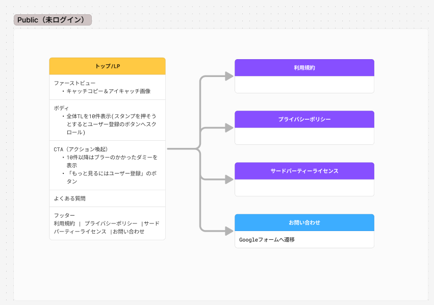
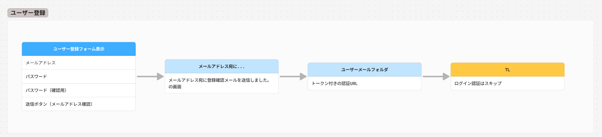
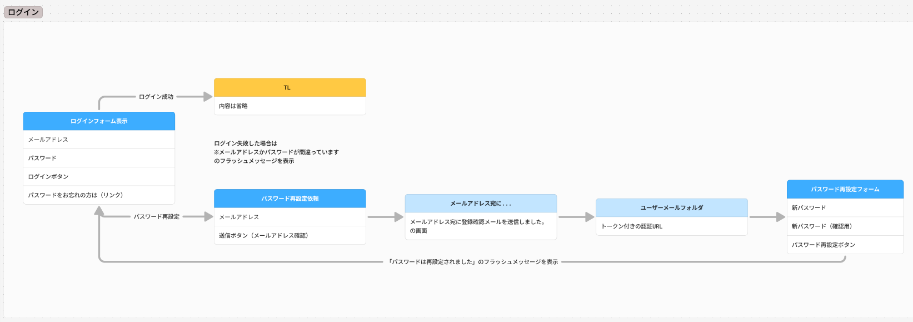
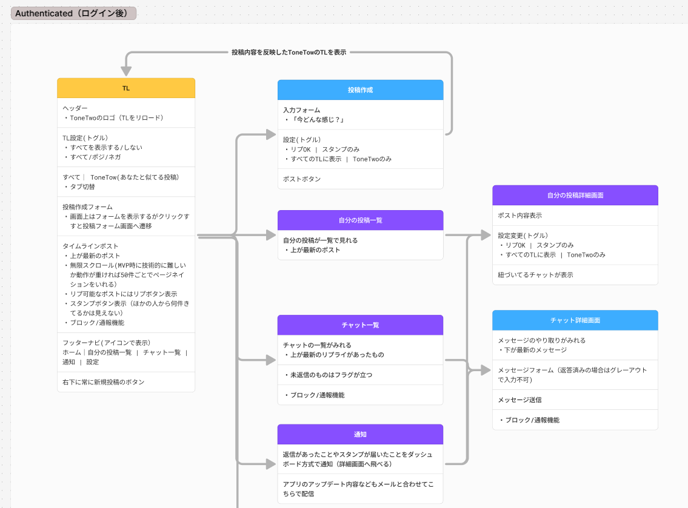
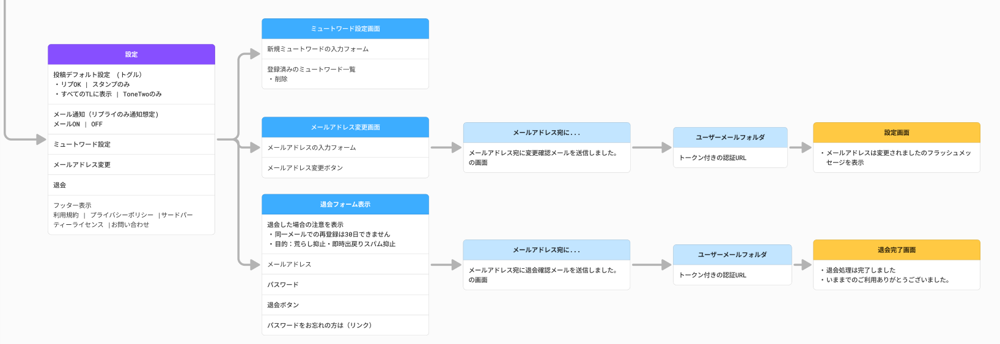
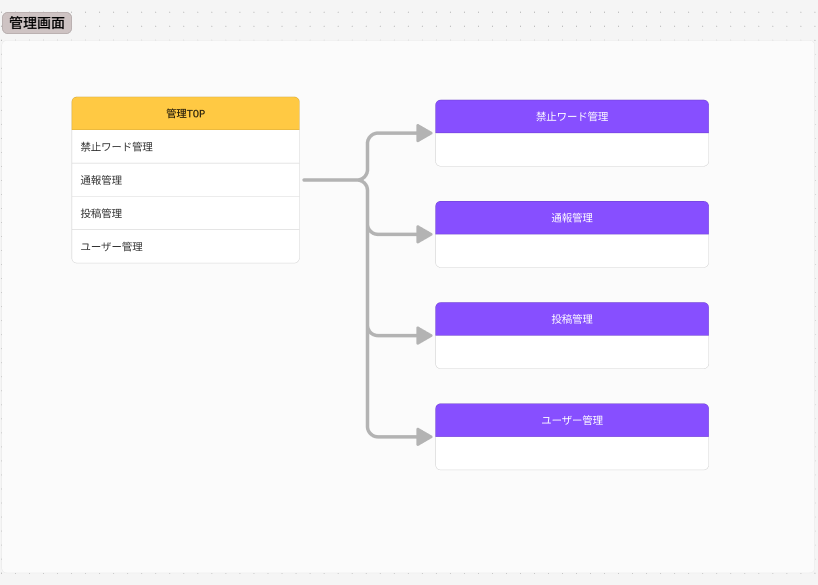

# ToneTwo サイトマップ（Routes一覧）

> 目的: 画面設計（サイトマップ）を Rails のルーティングに寄せて整理し、実装・漏れ確認をしやすくする。

---

## Public（未ログイン）

| 概要 | アクション | ヘルパー名 | HTTPメソッド | パス | コントローラー#アクション |
|---|---|---|---|---|---|
| トップ/LP | index | root_path | GET | `/` | `home#index` |
| 利用規約 | show | tos_path | GET | `/tos` | `pages#tos` |
| プライバシーポリシー | show | privacy_path | GET | `/privacy` | `pages#privacy` |
| サードパーティーライセンス | show | licenses_path | GET | `/licenses` | `pages#licenses` |
| ヘルプTOP | index | help_path | GET | `/help` | `help#index` |
| お問い合わせ（Googleフォームへ） | redirect | contact_path | GET | `/contact` | redirect to Google Form |

---

## 認証
https://guides.rubyonrails.org/sign_up_and_settings.html

| 概要 | アクション | ヘルパー名 | HTTPメソッド | パス | コントローラー#アクション |
|---|---|---|---|---|---|
| ユーザー登録フォーム表示 | show | sign_up_path | GET | `/sign_up` | `sign_ups#show` |
| ユーザー登録 | create | sign_up_path | POST | `/sign_up` | `sign_ups#create` |
| ログインフォーム表示 | new | new_session_path | GET | `/session/new` | `sessions#new` |
| ログイン | create | session_path | POST | `/session` | `sessions#create` |
| ログアウト | destroy | session_path | DELETE | `/session` | `sessions#destroy` |
| パスワード再設定（開始） | new | new_password_path | GET | `/passwords/new` | `passwords#new` |
| パスワード再設定（送信） | create | passwords_path | POST | `/passwords` | `passwords#create` |
| パスワード再設定（編集） | edit | edit_password_path | GET | `/passwords/:token/edit` | `passwords#edit` |
| パスワード再設定（更新） | update | password_path | PATCH | `/passwords/:token` | `passwords#update` |

---

## Authenticated（ログイン後）

## ナビ構成メモ
ホーム｜自分の投稿一覧 | チャット一覧 | 通知 | 設定

### TL（ホーム画面）

| 概要 | アクション | ヘルパー名 | HTTPメソッド | パス | コントローラー#アクション |
|---|---|---|---|---|---|
| TL（おすすめ = 全体TL）表示 | index | timeline_path | GET | `/timeline` | `timeline#index` |
| TL（あなたと似てる投稿）表示 | index | similar_timeline_path | GET | `/timeline/similar` | `timeline#similar` |

> 絞り込み（すべて/ポジ/ネガ）は、ルート追加ではなく **query param**（例：`/timeline?polarity=pos`）で扱う

### 投稿（作成・更新）

| 概要 | アクション | ヘルパー名 | HTTPメソッド | パス | コントローラー#アクション |
|---|---|---|---|---|---|
| 投稿作成フォーム | new | new_post_path | GET | `/posts/new` | `posts#new` |
| 投稿作成 | create | posts_path | POST | `/posts` | `posts#create` |
| 投稿詳細 | show | post_path | GET | `/posts/:id` | `posts#show` |
| 投稿の表示設定変更 | update | post_path | PATCH | `/posts/:id` | `posts#update` |

> 投稿の編集は、現時点では実装しない方針。

### 【ナビ】自分の投稿（専用）

| 概要 | アクション | ヘルパー名 | HTTPメソッド | パス | コントローラー#アクション |
|---|---|---|---|---|---|
| 自分の投稿一覧 | index | my_posts_path | GET | `/my/posts` | `my/posts#index` |
| 自分の投稿詳細 | show | my_post_path | GET | `/my/posts/:id` | `my/posts#show` |
> `my/posts#index` は「current_userの投稿だけ出す」ための専用一覧。 名前空間で区切る。

> /posts/:id で自分の投稿を開いたら /my/posts/:id にリダイレクト

### 【ナビ】チャット一覧

| 概要 | アクション | ヘルパー名 | HTTPメソッド | パス | コントローラー#アクション |　
|---|---|---|---|---|---|
| チャット一覧 | index | chats_path | GET | `/chats` | `chats#index` |
| チャット詳細 | show | chat_path | GET | `/chats/:id` | `chats#show` |
| メッセージ送信 | create | chat_messages_path | POST | 　`/chats/:chat_id/messages` | `messages#create` |

### 【ナビ】通知

| 概要 | アクション | ヘルパー名 | HTTPメソッド | パス | コントローラー#アクション |
|---|---|---|---|---|---|
| 通知/ダッシュボード | show | notifications_path | GET | `/notifications` | `dashboard#show` |

### 【ナビ】アカウント設定

### 【ナビ】アカウント設定（画面内で完結するものはPATCHのみ）

| 概要 | アクション | ヘルパー名 | HTTPメソッド | パス | コントローラー#アクション |
|---|---|---|---|---|---|
| アカウント設定TOP | show | settings_path | GET | `/settings` | `settings#show` |
| 投稿デフォルト設定（更新） | update | settings_post_defaults_path | PATCH | `/settings/post_defaults` | `settings/post_defaults#update` |
| TL表示デフォルト設定（更新） | update | settings_timeline_defaults_path | PATCH | `/settings/timeline_defaults` | `settings/timeline_defaults#update` |
| メール通知（更新） | update | settings_notifications_path | PATCH | `/settings/notifications` | `settings/notifications#update` |
| ミュートワード一覧（別ページ） | index | settings_mute_terms_path | GET | `/settings/mute_terms` | `settings/mute_terms#index` |
| ミュートワード追加 | create | settings_mute_terms_path | POST | `/settings/mute_terms` | `settings/mute_terms#create` |
| ミュートワード削除 | destroy | settings_mute_term_path | DELETE | `/settings/mute_terms/:id` | `settings/mute_terms#destroy` |
| メールアドレス変更（別ページ：入力） | edit | edit_settings_email_path | GET | `/settings/email/edit` | `settings/email#edit` |
| メールアドレス変更（確認メール送信） | update | settings_email_path | PATCH | `/settings/email` | `settings/email#update` |
| メールアドレス変更（確認リンク） | edit | edit_settings_email_confirmation_path | GET | `/settings/email/confirmations/:token/edit` | `settings/email/confirmations#edit` |
| メールアドレス変更（確定） | update | settings_email_confirmation_path | PATCH | `/settings/email/confirmations/:token` | `settings/email/confirmations#update` |
| 退会（別ページ：確認フォーム） | show | settings_withdrawal_path | GET | `/settings/withdrawal` | `settings/withdrawals#show` |
| 退会（実行） | destroy | settings_withdrawal_path | DELETE | `/settings/withdrawal` | `settings/withdrawals#destroy` |

## 通報 / ブロック（ユーザー操作）

| 概要 | アクション | ヘルパー名 | HTTPメソッド | パス | コントローラー#アクション |
|---|---|---|---|---|---|
| 通報（投稿を通報） | create | post_reports_path | POST | `/posts/:post_id/reports` | `reports#create` |
| ブロック（投稿の投稿者をブロック） | create | post_block_path | POST | `/posts/:post_id/block` | `blocks#create` |

### スタンプ（Slack風リアクション）

| 概要 | アクション | ヘルパー名 | HTTPメソッド | パス | コントローラー#アクション |
|---|---|---|---|---|---|
| 投稿にスタンプ | create | post_stamps_path | POST | `/posts/:post_id/stamps` | `posts/stamps#create` |
| チャットにスタンプ | create | chat_stamps_path | POST | `/chats/:chat_id/stamps` | `chats/stamps#create` |

---

## 管理画面（Administrate想定）

| 概要 | アクション | ヘルパー名 | HTTPメソッド | パス | コントローラー#アクション |
|---|---|---|---|---|---|
| 管理TOP | index | admin_root_path | GET | `/admin` | `admin/dashboard#index` |
| 禁止ワード管理 | CRUD | admin_blocked_words_path | GET/POST/PATCH/DELETE | `/admin/blocked_words...` | `admin/blocked_words#...` |
| 通報管理 | CRUD | admin_reports_path | GET/POST/PATCH/DELETE | `/admin/reports...` | `admin/reports#...` |
| 投稿管理 | CRUD | admin_posts_path | GET/POST/PATCH/DELETE | `/admin/posts...` | `admin/posts#...` |
| ユーザー管理 | CRUD | admin_users_path | GET/POST/PATCH/DELETE | `/admin/users...` | `admin/users#...` |

---
